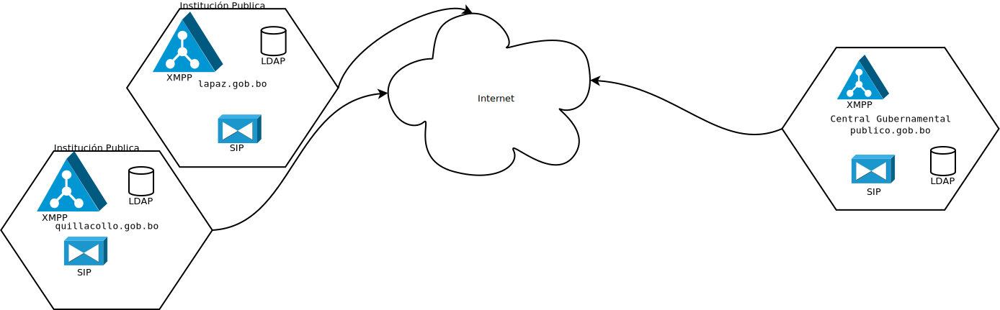

# Herramientas Social para Agetic y Administración Publica

## análisis preliminar

* ring.cx
* tox.chat
* kontalk.org
* jitsi.org
* gajim
* https://code.google.com/archive/p/jinglenodes
* rocket.chat

* conversations

* jitsi
* lumicall

# Propuesta de herramientas

## Servidores

### XMPP
* ejabberd   
  Nota: se instalara servidores con extensión XEP 0166: Jingle
* Salut à Toi

### SIP
* asterisk
* elastix

## Clientes

### XMPP Desktop
* jitsi

### XMPP Mobile (Android)
* conversations
* beem (implementación con XEP 0166)

### SIP Desktop
* linphone

### SIP Mobile (Android)
* linphone

## Arquitectura

