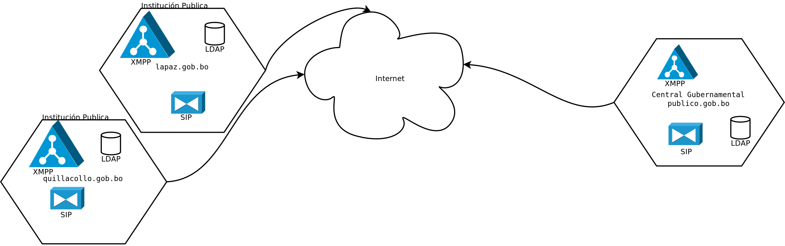

########################################################
Herramientas Social para Agetic y Administración Publica
########################################################

análisis preliminar
*******************

software considerados:

* `ring.cx <ring.cx>`_
* `tox.chat <tox.chat>`_
* `kontalk.org <kontalk.org>`_
* `jitsi.org <jitsi.org>`_
* `gajim.org <gajim.org>`_
* `rocket.chat <rocket.chat>`_
* `conversationsi.im <conversations.im>`_
* `jitsi.org <jitsi.org>`_
* `lumicall.org <lumicall.org>`_
* `Jingle Nodes <https://code.google.com/archive/p/jinglenodes>`_

Propuesta de herramientas
*************************

Servidores
==========

XMPP
----

* ejabberd
   Nota: se instalara servidores con extensión XEP 0166: Jingle
* Salut à Toi

SIP
---
* asterisk
* elastix

Clientes
========

XMPP Desktop
------------
* jitsi

XMPP Mobile (Android)
---------------------
* conversations
* beem (implementación con XEP 0166)

SIP Desktop
-----------
* linphone

SIP Mobile (Android)
--------------------
* linphone
* casca

Propuesta de arquitectura
*************************

