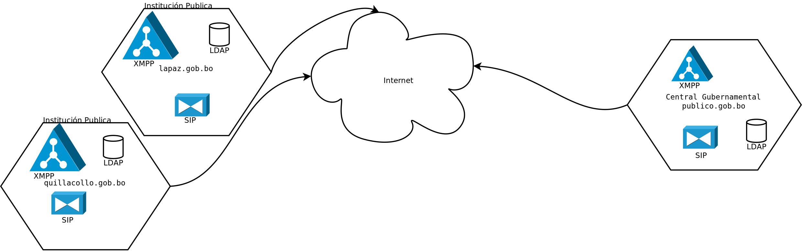

Comunicación Gubernamental
^^^^^^^^^^^^^^^^^^^^^^^^^^
.. contents::

Introducción
````````````

Actualmente, todos nos comunicamos, ya sea con la familia o compañeros de
trabajo, y sabemos, gracias a Edward Snowden, que estas conversaciones nunca
fueron privadas.

El presente documento se refiere a una serie de propuestas para la
implementación de un servicio de comunicación entre los funcionarios públicos
del Estado Plurinacional de Bolivia.

Las funcionalidades del servicio incluyen un sistema de chat, redes sociales,
un sistema de vídeo conferencia y por ultimo una solución para llamadas de voz.
Las herramientas utilizadas tienen que adherir a los principios de software
libre y de soberanía tecnológica.

En particular se requiere que las soluciones utilizadas:

* implementen software libre
* implementen estándares abiertos
* no sean alojadas en el exterior
* tengan integración con LDAP
* permitan la búsqueda de usuarios
* permitan la organización de usuarios en grupos

Las soluciones tienen un tiempo de implementación organizado en tres fases. La
primera fase consiste en la activación de los servicios para los funcionarios
internos de AGETIC. Es una fase de test en la cual se pone particular enfoque
en las características de escalabilidad y usabilidad del servicio.

La segunda fase contempla la extensión del servicio al conjunto de funcionarios
públicos del estado. Esta fase requiere un nivel de estabilidad, seguridad y
usabilidad muy alto.

La tercera fase incluye la posibilidad de abrir el servicio a la población en
general. El objetivo de esta fase es de mejorar la comunicación entre
funcionario publico y ciudadano.

Podemos utilizar algunas herramientas para tener un sistema de comunicación
federado y seguro, Basado en XMPP, LDAP y SIP.

Arquitectura General
````````````````````

Como esquema general tenemos

- Un servidor de todas las entidades gubernamentales (publico.gob.bo)
- Cada institución publica puede definir si mantiene sus propios servidores o
  si utiliza el servidor gubernamental (Federalización)




XMPP
````

Extensible Messaging and Presence Protocol, más conocido como XMPP (Protocolo
extensible de mensajería y comunicación de presencia) (anteriormente llamado
Jabber1 ), es un protocolo abierto y extensible basado en XML, originalmente
ideado para mensajería instantánea.

Sabemos que para tener un servidor `XMPP Seguro <http://wiki.xmpp.org/web/Securing_XMPP>`_
debemos tener como minimo esto:

- Un certificado SSL
- Que la configuración del servidor no permita ninguna conmunicacion en texto
  plano
- y que soporte XEP-198


SIP
```

Session Initiation Protocol (SIP o Protocolo de Inicio de Sesiones) es un
protocolo desarrollado por el grupo de trabajo MMUSIC del IETF con la intención
de ser el estándar para la iniciación, modificación y finalización de sesiones
interactivas de usuario donde intervienen elementos multimedia como el video,
voz, mensajería instantánea, juegos en línea y realidad virtual.

Actualmente es la norma de facto para VOIP y es la alternativa para hacer
conferencias de video.

 - `SIP Seguro <https://en.wikipedia.org/wiki/Session_Initiation_Protocol#Encryption>`_


`Identidad federada <https://es.wikipedia.org/wiki/Identidad_federada>`_
``````````````````````````````````````````````````````````````````````````

La identidad federada es una de las soluciones para abordar la gestión de
identidad en los sistemas de información. El valor añadido adicional respecto a
otras soluciones es la gestión de identidad interdependiente entre compañías, lo
que se denomina Federated Identity Management.

Para conseguir este fin de manera simple podemos utilizar `OpenID <https://es.wikipedia.org/wiki/OpenID>`_
junto con LDAP

OpenID
``````

OpenID es un estándar de identificación digital descentralizado, con el que un
usuario puede identificarse en una página web a través de una URL (o un XRI en
la versión actual) y puede ser verificado por cualquier servidor que soporte el
protocolo.

LDAP
````

LDAP son las siglas de Lightweight Directory Access Protocol (en español
Protocolo Ligero/Simplificado de Acceso a Directorios) que hacen referencia a un
protocolo a nivel de aplicación que permite el acceso a un servicio de
directorio ordenado y distribuido para buscar diversa información en un entorno
de red. LDAP también se considera una base de datos (aunque su sistema de
almacenamiento puede ser diferente) a la que pueden realizarse consultas.

Funambol
````````

Funambol es un servidor de aplicaciones para móviles que ofrece:
- push e-mail
- libreta de direcciones
- sincronización de datos de calendario (PIM)
- gestión de dispositivos

aprovechando el protocolo SyncML (OMA). Para los usuarios, esto significa que las
capacidades de empresariales de BlackBerry, estan disponibles en los teléfonos
básicos.

Instalación de soluciones existentes
````````````````````````````````````

Esta opción preve la instalación de servicios basados sobre dos protocolos:
**Extensible Messaging and Presence Protocol**  (XMPP) y **Session Initiation
Protocol** (SIP).

Actualmente no se encuentran soluciones XMPP disponibles para vídeo llamadas en
entorno móvil. Para poder activar un servicio de llamadas en entorno móvil se
presenta la necesidad de adoptar el protocolo SIP.

La ventaja de esta solución es la falta de necesidad de desarrollo. La desventaja
consiste en la necesidad de instalar servidores distintos para los dos
protocolos. Se presenta también la posibilidad de necesitar diferentes clientes
sobre todo en entorno móvil.

Desarrollo de funcionalidades para clientes XMPP
************************************************

Esta opción preve la instalación de servicios basados sobre un único protocolo:
**XMPP**.

La ventaja de esta solución es la posibilidad de utilizar solo servidores XMPP.

Implementando esta opción se limita también el numero de clientes.

Una desventaja de esta opción consiste en la necesidad de implementar las
funcionalidades faltantes, con los relativos tiempos y costos de desarrollo.

Referencias
```````````

Se revisaron las características de las siguientes aplicaciones:

* `ring.cx <http://ring.cx>`_
* `tox.chat <http://tox.chat>`_
* `kontalk.org <http://kontalk.org>`_
* `jitsi.org <http://jitsi.org>`_
* `gajim.org <http://gajim.org>`_
* `rocket.chat <http://rocket.chat>`_
* `conversationsi.im <http://conversations.im>`_
* `jitsi.org <http://jitsi.org>`_
* `lumicall.org <http://lumicall.org>`_
* `Jingle Nodes <https://code.google.com/archive/p/jinglenodes>`_
